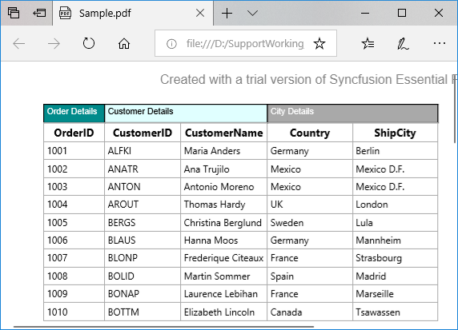
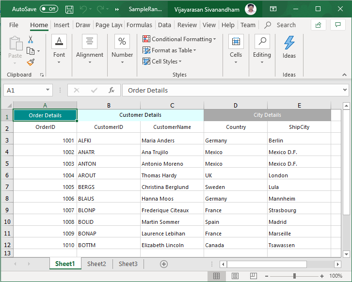

# How to Export the WinForms DataGrid StackedHeaders with Different BackColor to Excel and PDF?

This example illustrates how to export the [WinForms DataGrid](https://www.syncfusion.com/winforms-ui-controls/datagrid) (SfDataGrid) StackedHeaders with different back color to Excel and PDF

## Pdf Exporting

By default, background color is not applied for [StackedHeaderRow](https://help.syncfusion.com/cr/windowsforms/Syncfusion.WinForms.DataGrid.StackedHeaderRow.html) when export a `DataGrid` to PDF, you can apply the back color by using [PdfGridCell](https://help.syncfusion.com/cr/windowsforms/Syncfusion.Pdf.Grid.PdfGridCell.html) in [PdfExportingOptions.CellExporting](https://help.syncfusion.com/cr/windowsforms/Syncfusion.WinForms.DataGridConverter.ExcelExportingOptions.html#Syncfusion_WinForms_DataGridConverter_ExcelExportingOptions_CellExporting) event.

```C#
private void PDF_Exporting(object sender, EventArgs e)
{
    PdfExportingOptions options = new PdfExportingOptions();
    options.ExportStackedHeaders = true;
    options.CellExporting += options_CellExporting;
    var document = sfDataGrid1.ExportToPdf(options);
    document.Save("Sample.pdf");
}

private void options_CellExporting(object sender, DataGridCellPdfExportingEventArgs e)
{
    if(e.CellType==ExportCellType.StackedHeaderCell)
    {
        if(e.CellValue.ToString()=="Order Details")
        {
            var cellStyle = new PdfGridCellStyle();
            cellStyle.BackgroundBrush = PdfBrushes.DarkCyan;
            cellStyle.TextBrush = PdfBrushes.White;
            e.PdfGridCell.Style = cellStyle;
        }
        else if (e.CellValue.ToString() == "Customer Details")
        {
            var cellStyle = new PdfGridCellStyle();
            cellStyle.BackgroundBrush = PdfBrushes.LightCyan;
            e.PdfGridCell.Style = cellStyle;
        }
        else if (e.CellValue.ToString() == "City Details")
        {
            var cellStyle = new PdfGridCellStyle();
            cellStyle.BackgroundBrush = PdfBrushes.DarkGray;
            cellStyle.TextBrush = PdfBrushes.White;
            e.PdfGridCell.Style = cellStyle;
        }
    }     
}
```



## Excel Exporting

By default, background color is not applied for [StackedHeaderRow](https://help.syncfusion.com/cr/windowsforms/Syncfusion.WinForms.DataGrid.StackedHeaderRow.html) when export a SfDataGrid to excel, you can apply the back color by set the color for specific cell range in exported work book.

```C#
private void Excel_Exporting(object sender, EventArgs e)
{
    var options = new ExcelExportingOptions();
    var excelEngine = sfDataGrid1.ExportToExcel(sfDataGrid1.View, options);
    var workBook = excelEngine.Excel.Workbooks[0];
    workBook.Worksheets[0].Range["A1:A1"].CellStyle.Color = Color.DarkCyan;
    workBook.Worksheets[0].Range["A1:A1"].CellStyle.Font.Color = ExcelKnownColors.White;
    workBook.Worksheets[0].Range["B1:C1"].CellStyle.Color = Color.LightCyan;
    workBook.Worksheets[0].Range["B1:C1"].CellStyle.Font.Color = ExcelKnownColors.Black;
    workBook.Worksheets[0].Range["D1:E1"].CellStyle.Color = Color.DarkGray;
    workBook.Worksheets[0].Range["D1:E1"].CellStyle.Font.Color = ExcelKnownColors.White;
    workBook.SaveAs("SampleRange.xlsx");
 }
```

